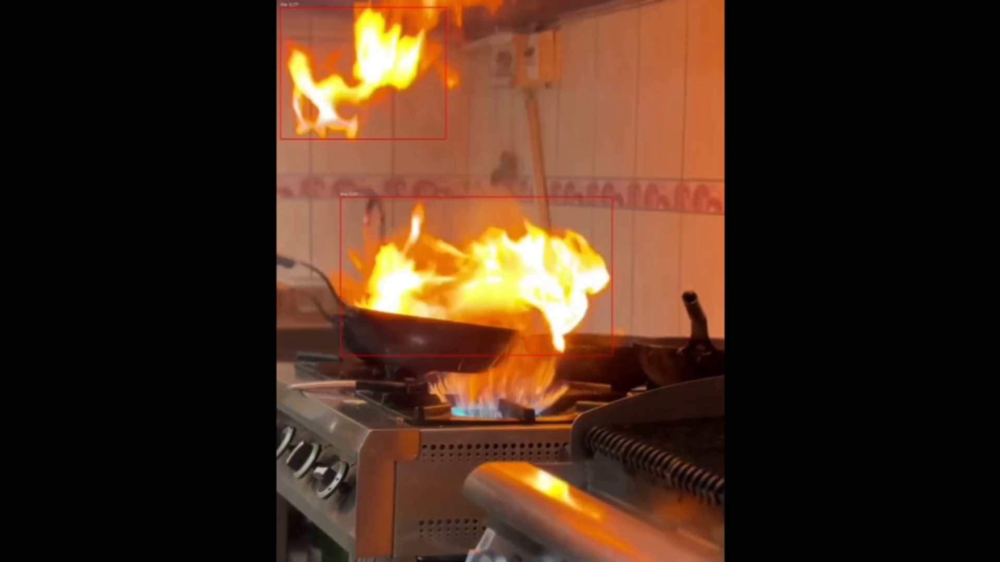

# Realtime Fire & Smoke Detection

This project provides a simple real-time fire and smoke detection system using a trained PyTorch model.

## Demo Preview

[](assets/demo.mp4)

## Installation

```bash
pip install -r requirements.txt

⚠ Important: PyTorch Installation
CPU version (recommended)

GPU version
https://pytorch.org/get-started/locally/


run 
main.py


